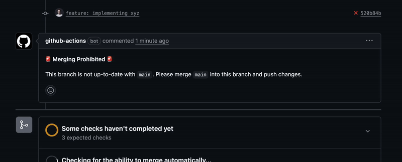
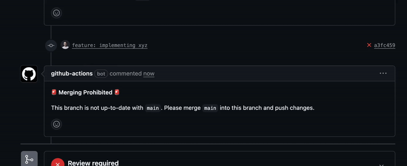
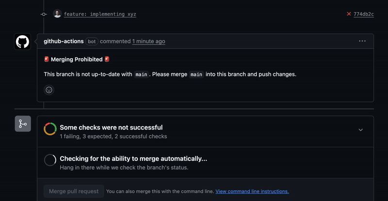
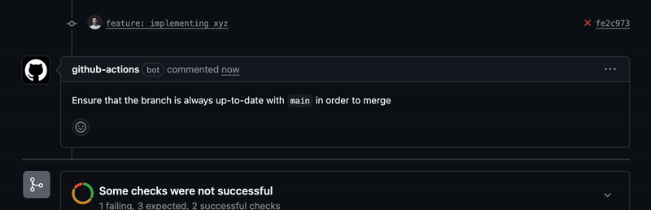

# actions-pr-comment
> GitHub action for creating, updating, and hiding comments on pull requests



## Assumptions
1. A message body is ready to be used as a comment. This can be either passed directly via `comment-body` or as a file via `comment-body-path`.

## Inputs
All inputs for this action are summarized below for quick reference:

| Name                | Type   | Default                | Required? | Description                                                                                  |
|---------------------|--------|------------------------|-----------|----------------------------------------------------------------------------------------------|
| `comment-id`        | string | —                      | Yes       | Unique identifier for the comment/check.                                                     |
| `comment-body`      | string | —                      | No        | Text to use as the comment body.
| `comment-body-path` | string | —                      | No        | Path to markdown file for comment body.
| `conclusion`        | string | —                      | Yes       | Workflow result: `success`, `failure`, `skipped`, or `cancelled`.                           |
| `github-token`      | string | `${{ github.token }}`  | No        | GitHub token used by `github-actions[bot]` to leave comments.                                                   |
| `render-markdown`   | boolean | `true`                 | No        | Render the comment body as markdown.                                                     |
| `sync-conclusion`| boolean | `false`                | No        | Hide previous failure comment when resolved. If the initial comment is `conclusion: success` and this is set to `true`, then the comment will not be created.                                       |
| `update-mode`       | string | `"create"`               | No        | How to handle existing comments: `replace`, `append`, `create`, or `none`.                   |
| `verbose-logging`   | boolean | `false`                | No        | Enable verbose logging.                                                            |

### Example Usage
```yaml
- name: Create PR Comment
  uses: colpal/actions-pr-comment@v1
  if: ${{ !cancelled() }}
  with:
    comment-id: "my-check"
    comment-body: "My comment here"
    conclusion: "${{ steps.<step_id>.outcome }}"
    github-token: "${{ github.token }}"
    render-markdown: true
    sync-conclusion: false
    update-mode: "create"
    verbose-logging: false
```

### Why use `if: ${{ !cancelled() }}`?

To ensure this action runs after a workflow step, even if that step fails, use `if: ${{ !cancelled() }}`. This lets the comment action run unless the workflow is cancelled.

Avoid using `continue-on-error: true` on the previous step. While it allows the comment action to run after a failure, it also marks the workflow as successful, which can be misleading.

**Use `if: ${{ !cancelled() }}` on this action to run it after any step, regardless of success or failure, while keeping the workflow status accurate.**

## Permissions
For this action to do its job to the fullest, it will require some permissions. In the workflow file that is calling this action, there should be a permission block. The following permissions are required for `secrets.GITHUB_TOKEN` in the workflow:
```yaml
permissions:
  pull-requests: write
```
- `pull-requests: write` → this is to create and update comments on a pull request
  - `write` permissions come with `read` permissions, which are required to find all comments on a pull request in order to find previous comments to update.

## Outputs
The action places or updates a comment in the pull request. The comment includes:

- The supplied `comment-body` or contents of `comment-body-path`.
- Hidden identifiers at the beginning of the body:
  - `<!-- comment-id: my-check -->` (for identifying the comment)
  - `<!-- conclusion: success -->` (for tracking status and visibility)

## Comment-Id
The `comment-id` input is a unique identifier for the comment. It is an hidden identifier that is placed at the beginning of the comment body. It is used to identify the comment in the pull request and to track its visibility. When updating or hiding future comments, the action will look for a comment with the same `comment-id` and update it accordingly.

Furthermore, it allows the same user (typically `github-actions[bot]`) to leave multiple comments at the same time without conflicting with each other. It serves as another identifier to distinguish between different comments. With this, this action can be apart of multiple workflows that leave comments on the same pull request, and not conflict with each other's update methods and contents.

## Comment Body and Comment Body Path
The `comment-body` input is the text to use as the comment body. This accepts the body of the comment as a string.

The `comment-body-path` input is the path to a markdown file for the comment body. This accepts the path to a file which contains the content for the comment body. The file _should_ be a markdown file.

Both fields cannot be supplied at once. If both are supplied, the action will fail. However, neither field can be supplied and then an empty comment will be generated

## Conclusion
The `conclusion` input is a hidden identifier that tracks the status of the current run. It works with [`sync-conclusion`](#sync-conclusion) to control comment visibility. Use `steps.<step_id>.outcome` for this value. Possible values and their effects:

| Value      | Effect                                                                                   |
|------------|-----------------------------------------------------------------------------------------|
| `success`  | Sets hidden identifier to `success`. Indicates the step succeeded.                      |
| `failure`  | Sets hidden identifier to `failure`. Indicates the step failed.                         |
| `skipped`  | Sets hidden identifier to `skipped`. No new comment created/updated. May hide existing. |
| `cancelled`| Sets hidden identifier to `cancelled`. No new comment created/updated.                  |

## Render-Markdown
This flag controls whether the comment body should be rendered as markdown or not. Useful for files like Terraform plans which might not want to be rendered as markdown.

- If `render-markdown` is `true`, the comment body will be rendered as markdown.
  - `**bold**` will be rendered as **bold** instead of `**bold**`.
- If `render-markdown` is `false`, the comment body will be rendered as plain text, such that markdown formatting is not applied.
  - `**bold**` will be rendered as `**bold**` instead of **bold**.

## Sync-Conclusion
This flag controls whether successful comments are hidden automatically. When set to `"true"`:

- If `conclusion` is `success`, the comment is hidden.
  - If `conclusion` is `success` and it's the **first** comment, then the comment is not created at all.
- If updating a previous comment with `failure` or `neutral`, it will be hidden after update.
- If a future comment is no longer `success`, it will update and unhide itself according to `update-mode`.
- Hidden comments remain up-to-date, so if you unhide them, the content is correct.

## Update Mode

The `update-mode` input controls how the action handles existing comments with the same `comment-id`.

| Option    | Description                                                                                   |
|-----------|----------------------------------------------------------------------------------------------|
| `create`  | Always creates a new comment, regardless of whether previous comments with the same `comment-id` exist. This can result in multiple comments for the same check; outdated ones are hidden in the GitHub UI. |
| `replace` | Overwrites the content of an existing comment entirely with the new comment body. If no existing comment is found, creates a new one. |
| `append`  | Adds the new comment body to the end of an existing comment, separated by a timestamp. If no existing comment is found, creates a new one. |
| `none`    | Does not create a new comment or update existing comments after the initial one. Will create the initial comment when no matching `comment-id` is found, but will not perform any updates after. |

### Examples
<details>
<summary>Creating New Comment and Hiding Previous Comment</summary>
<br>

</details>

<details>
<summary>Replacing Previous Comment</summary>
<br>

</details>

<details>
<summary>Appending to Previous Comment</summary>
<br>

</details>

<details>
<summary>Performing No Updates to Previous Comment</summary>
<br>

</details>

## Logging
Set `verbose-logging: true` to enable detailed logs for debugging.

## Examples

### Using `Comment-Body`
Posts a comment to the pull request with the message "Linting passed successfully!".

```yaml
- name: Create PR Comment
  uses: colpal/actions-pr-comment@v1
  if: ${{ !cancelled() }}
  with:
    comment-id: "lint-check"
    comment-body: "Linting passed successfully!"
    conclusion: "${{ steps.<step_id>.outcome }}"
    github-token: "${{ secrets.github-token }}"
    update-mode: "create"
    sync-conclusion: true
```

### Using a Markdown File with `Comment-Body-Path`
Posts the contents of `path/test-results.md` as the comment body, replacing any previous comment for the same check.

```yaml
- name: Create PR Comment
  uses: colpal/actions-pr-comment@v1
  if: ${{ !cancelled() }}
  with:
    comment-id: "test-results"
    comment-body-path: "path/test-results.md"
    conclusion: "${{ steps.<step_id>.outcome }}"
    github-token: "${{ secrets.github-token }}"
    verbose-logging: true
    update-mode: "replace"
    sync-conclusion: false
```

### Further Examples
Within the [.github/workflows](.github/workflows) directory, there are test workflows that demonstrate most configurations of this action. They are grouped by functionality and can be added to an open pull request by attaching a matching label to it. The workflow will run and post comments to the pull request on label attachment, pushes to the branch, and when the pull request is opened (such that closing and reopening will maintain the label and trigger a pull-request open event).
- [Test Comment Conclusions](.github/workflows/test-comment-conclusions.yaml)
  - Tests `conclusion` functionality
  - Label: `test-conclusions`
- [Test Comment Inputs](.github/workflows/test-comment-inputs.yaml)
  - Tests `comment-body`, `comment-body-path`, and `render-markdown` functionality
  - Label: `test-inputs`
- [Test Comment Sync Conclusions](.github/workflows/test-comment-sync-conclusions.yaml)
  - Tests `sync-conclusion` functionality
  - Label: `test-sync-conclusions`
- [Test Update Mode](.github/workflows/test-comment-update-mode.yaml)
  - Tests `update-mode` functionality
  - Label: `test-update-mode`

### References
Below are some already implemented instances of colpal workflows and actions utilizing this action:
- [Airflow Dagbag Scanner](https://github.com/colpal/airflow/blob/v1.1/actions/dagbag-scanner/action.yaml#L142)
- [Airflow Validation](https://github.com/colpal/airflow/blob/v1.1/.github/workflows/validation.yaml#L142)

## Tests

This project includes a test directory containing a test suite that covers the functionality of this action. The tests are written in Jest and can be run using `npm test`. The test suite is run automatically by the `test-and-coverage.yaml` workflow, which ensures that at least 95% of the lines, branches, functions, and statements are covered and that there are no failing tests. You can read more about the test suite [here](tests/README.md).

## Changelog

See [CHANGELOG.md](CHANGELOG.md) for a list of changes.
