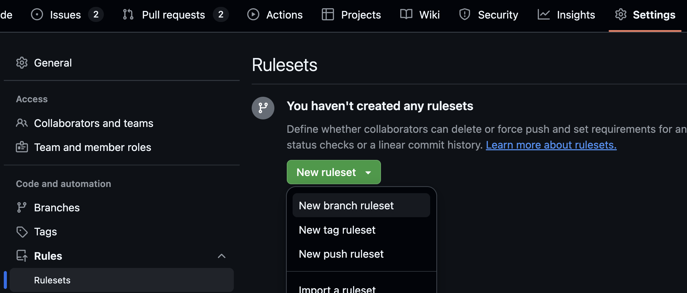
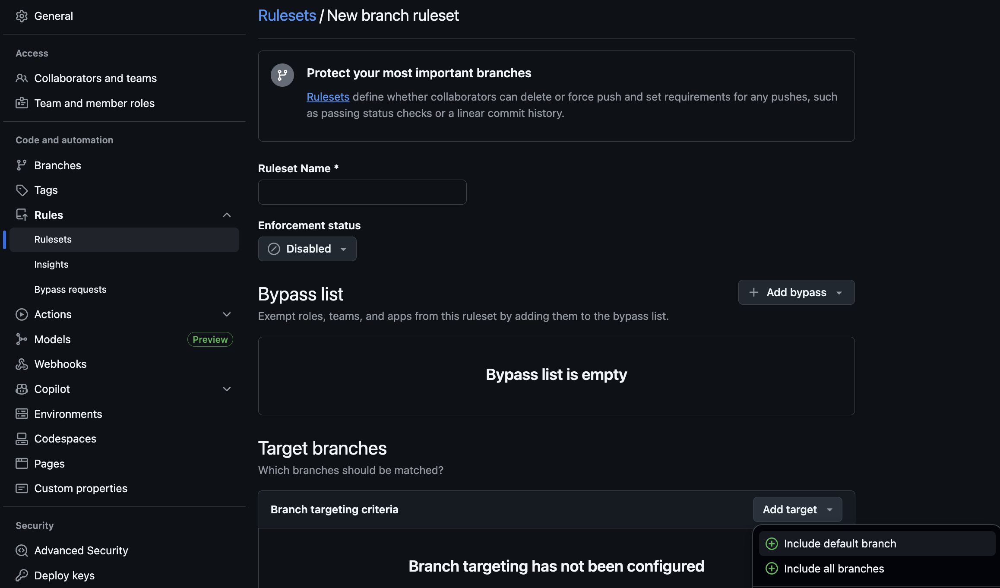
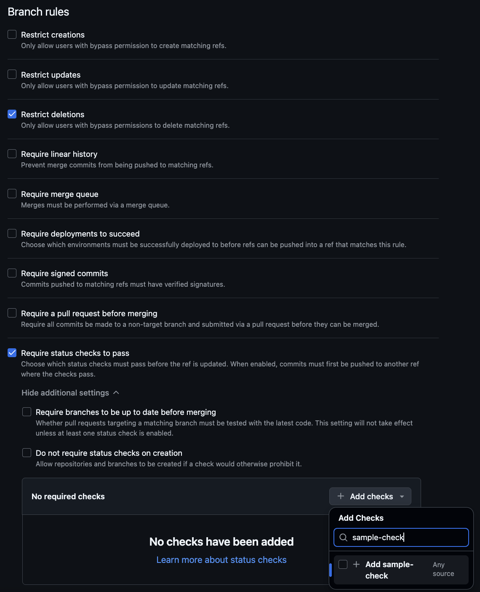

# actions-pr-comment
> Internal action for creating comments on pull requests

## Assumptions
1. A message body is ready to be used as a comment, either passed directly via `comment-body` or as a markdown file via `comment-body-path`
2. The "result" of the job that generates the comment is known. Such that this job can be told whether to mark the commit as a `success` or `failure` (via the `conclusion` input)

## Usage
```yaml
- uses: colpal/action-pr-comment@v0.1.0
  with:
    # Name of the check. To be used in the identifying comment and as the display name of GitHub for this action
    # Required
    comment-id: "my-check"

    # The contents of the text to be used as the message body
    # Optional - used instead of comment-body-path
    comment-body: "My comment here"

    # The path where the markdown (.md) file is stored which holds the text to be used as the message body
    # Optional - used instead of comment-body
    comment-body-path: "example/custom-path"
    
    # Result of the workflows that are providing the comments to be posted. Will be set to "success" or "failure" such that this action can prevent merge whilst posting comments explaining the problem
    # Optional
    # Default: "neutral"
    conclusion: "success"

    # The GitHub token used for authentication
    # Optional
    # Default: "${{ github.token }}"
    github-token: "${{ github.token }}"

    # Verbose logging flag for more detailed information
    # Optional
    # Default: false
    verbose-logging: false

    # How to handle existing comments. Options: 'replace' (overwrite), 'append' (add to end), 'create' (always make a new comment)
    # Required
    # Default: "create"
    update-mode: "create"

    # Determines whether to hide a previous failure comment when the conclusion changes to 'success' and update-mode is 'replace' or 'append'
    # Optional
    # Default: false
    on-resolution-hide: false
```

## Outputs
A comment will be placed (or updated) in the pull request. The comment will be the supplied `comment-body` (or contents of `comment-body-path`) as well as a hidden identifier that is placed at the beginning of the body via `comment-id`.

A status check (see below for setup) will be emitted from the action run. When the job is triggered, it will create a status check and set the `status` to `in_progress`. Upon completion, the `status` will be updated to `completed`. The `conclusion` field will be populated with either `success` or `failure` (or `neutral`). The `conclusion` field is received as an input and is a way to tell this job to prevent or allow merges. If the comment wants an action from a user (e.g. there is a violation that needs remedying), then the `conclusion` can be set to `failure` and since the status check has failed, merges should be prevented (if the ruleset is configured properly). If the comment is to notify the user that everything looks good, can set the `conclusion` to `success` and the commit is passed and a merge can be performed. 

## Status Check Setup
### Create New Ruleset


### Choose Target Branch(es)


### Add Check

The check supplied here should match the name provided in the `comment-id` input field on the action. If the action has been triggered before, it **should** show up in the "Suggestions" tab as you type it. If not, then the name can be supplied and it **should** detect on the first run of the action

## Logging
To enable verbose logging to gather more information about the action as it is running, set the `verbose-logging` argument to `true`. Reference the [markdown file example](#example-using-a-markdown-file) below 

## Examples
### Example: Basic Usage

```yaml
- uses: colpal/action-pr-comment@v0.1.0
  with:
    comment-id: "lint-check"
    comment-body: "Linting passed successfully!"
    conclusion: "success"
    github-token: "${{ secrets.github-token }}"
    update-mode: "create"
    on-resolution-hide: true
```

This example posts a comment to the pull request with the message "Linting passed successfully!" and sets the status check to `success`.

### Example: Using a Markdown File

```yaml
- uses: colpal/action-pr-comment@v0.1.0
  with:
    comment-id: "test-results"
    comment-body-path: "path/test-results.md"
    conclusion: "failure"
    github-token: "${{ secrets.github-token }}"
    verbose-logging: true
    update-mode: "replace"
    on-resolution-hide: false
```

This example posts the contents of `path/test-results.md` as the comment body and sets the status check to `failure`, replacing any previous comment for the same check.