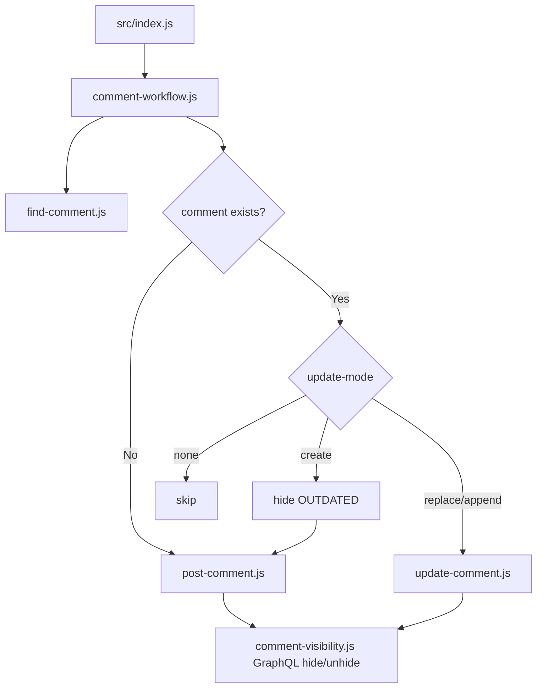

# `src` (Source Code)

## Logical Flow

```mermaid
flowchart TD
    A[src/index.js] --> B[comment-workflow.js]
    B --> C[find-comment.js]
    B --> D{comment exists?}
    D -->|No| E[post-comment.js]
    D -->|Yes| F{update-mode}
    F -->|create| G[hide OUTDATED] --> E
    F -->|replace/append| H[update-comment.js]
    F -->|none| I[skip]
    E & H --> J[comment-visibility.js GraphQL hide/unhide]
```
